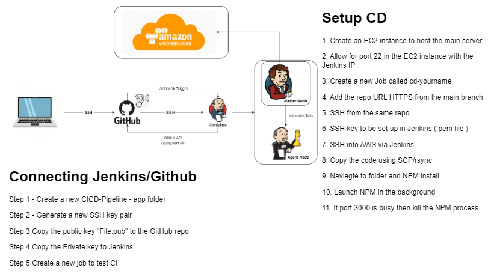

# Setup



## Login to Jenkins

1. Open a browser and go to the Jenkins server URL: `http://<Jenkins-Server-IP>:8080`
2. Login using the username and password provided by the instructor

## Create a new SSH key pair between Jenkins and GitHub

1. Create a new SSH key pair called `eng130_jenkins_name` using the following command:

```bash
ssh-keygen -t rsa -b 4096 -C "eng130_jenkins_name" -f ~/.ssh/eng130_jenkins_name
```

2. Copy the contents of the `eng130_jenkins_name.pub` file to the GitHub repository

3. Copy the contents of the `eng130_jenkins_name` file to the Jenkins server

## Setup an EC2 instance

1. Create a new EC2 instance called `eng130_jenkins_name`
2. Setup the instance with the following details:
    - AMI: `Ubuntu Server 18.04 LTS (HVM), SSD Volume Type` or `personally-AMI`
    - Instance Type: `t2.micro`
    - VPC: `Default VPC`
    - Subnet: `Default subnet`
    - Auto-assign Public IP: `Enable`
    - Security Group: `Create a new security group`
        - Security group name: `eng130_jenkins_name`
        - Description: `eng130_jenkins_name`
        - Inbound Rules:
            - Type: `SSH`, Source: `Jenkins Server IP`
            - Type: `SSH`, Source: `My IP`
            - Type: `HTTP`, Source: `Anywhere`
    - Key Pair: `eng130`

## Setup GitHub Webhook

1. Select `Settings` from the GitHub repository
2. Select `Webhooks` from the left hand menu
3. Select `Add webhook`
4. Enter the Jenkins server URL: `http://<Jenkins-Server-IP>:8080/github-webhook/`
5. Select `Content type` as `application/json`
6. Select `Add webhook`

## Create 3 new Jenkins Jobs for CI/CD Pipeline

### Countious Integration Job

1. Select `New Item` from the Jenkins Dashboard
2. Create a new Jenkins Job to test the `dev` branch, called `name_dev_test`
3. Select `Freestyle project` and click `OK`
4. Select `Discard old builds` and set the number of builds to keep to `3`
5. Select `GitHub project` and enter the GitHub repository URL
6. Select `Restrict where this project can be run` and select `sparta-ubuntu-node`
7. Select `Source Code Management` and select `Git`
8. Enter the GitHub repository SSH URL
9. Select `Add` and enter the private key for the `eng130_jenkins_name` key pair
10. Select `Branches to build` and enter `*/dev`
11. Select `Build Triggers` and select `GitHub hook trigger for GITScm polling`
12. Select `Add build step` and select `Execute shell`
13. Enter the following commands:

```bash
cd app
npm install
npm test
```

### Merge to Dev and Main Job

1. Select `New Item` from the Jenkins Dashboard
2. Create a new Jenkins Job to merge the `dev` branch to the `main` branch, called `name_dev_main`
3. Select `Freestyle project` and click `OK`
4. Select `Discard old builds` and set the number of builds to keep to `3`
5. Select `GitHub project` and enter the GitHub repository URL
6. Select `Restrict where this project can be run` and select `sparta-ubuntu-node`
7. Select `Source Code Management` and select `Git`
8. Enter the GitHub repository SSH URL
9. Select `Add` and enter the private key for the `eng130_jenkins_name` key pair
10. Select `Branches to build` and enter `*/dev`
11. Select `Add build step` and select `Execute shell`
12. Enter the following commands:

```bash
git status

git checkout main
git merge origin/dev
```

### Countious Deployment Job

1. Select `New Item` from the Jenkins Dashboard
2. Create a new Jenkins Job to deploy the `main` branch to the EC2 instance, called `name_main_deploy`
3. Select `Freestyle project` and click `OK`
4. Select `Discard old builds` and set the number of builds to keep to `3`
5. Select `GitHub project` and enter the GitHub repository URL
6. Select `Restrict where this project can be run` and select `sparta-ubuntu-node`
7. Select `Source Code Management` and select `Git`
8. Enter the GitHub repository SSH URL
9. Select `Add` and enter the private key for the `eng130_jenkins_name` key pair
10. Select `Branches to build` and enter `*/main`
11. Select `SSH Agent` and select `Add` and enter the private key for the `eng130_jenkins_name` key pair
12. Select `Add build step` and select `Execute shell`
13. Enter the following commands:

```bash
rsync -avz -e "ssh -o StrictHostKeyChecking=no" app ubuntu@54.195.193.43:/home/ubuntu/eng130-aws-node-app/
rsync -avz -e "ssh -o StrictHostKeyChecking=no" environment ubuntu@54.195.193.43:/home/ubuntu/eng130-aws-node-app/
ssh -A -o "StrictHostKeyChecking=no" ubuntu@54.195.193.43 << EOF

cd eng130-aws-node-app/
cd app/
sudo killall -9 node
npm install
nohup node app.js > /dev/null 2>&1 &
EOF
```

### Seed the Database

1. Select `New Item` from the Jenkins Dashboard
2. Create a new Jenkins Job to seed the database, called `name_seed_db`
3. Select `Freestyle project` and click `OK`
4. Select `Discard old builds` and set the number of builds to keep to `3`
5. Select `Restrict where this project can be run` and select `sparta-ubuntu-node`
6. Select `SSH Agent` and select `Add` and enter the private key for the `eng130_jenkins_name` key pair
7. Select `Add build step` and select `Execute shell`
8. Enter the following commands:

```bash
ssh -A -o "StrictHostKeyChecking=no" ubuntu@54.195.193.43 << EOF
sudo killall -9 node

if ["$DB_HOST" = ""]
then
  export DB_HOST=mongodb://10.0.16.36:27017/posts >> .bashrc
  sudo source .bashrc
  echo 'IN THE IF STATMENT'
  
  cd eng130-aws-node-app/
  cd app/
  npm install
  nohup node app.js > /dev/null 2>&1 &
else
    echo 'IN THE ELSE STATMENT'
    cd eng130-aws-node-app/
    cd app/
    npm install
    nohup node app.js > /dev/null 2>&1 &
fi
EOF
```
