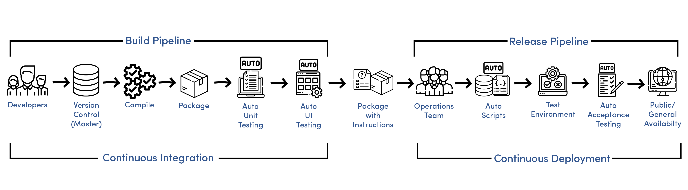

# Jenkins

## CICD



CICD is a process of automating the build and deployment of software. It is a combination of Continuous Integration and Continuous Delivery, which is a part of DevOps. It is beneficial for the business as it helps in reducing the time to market and the cost of the software. It also helps in improving the quality of the software.

### What is Continuous Integration?

Continuous Integration is a software development practice where developers integrate code into a shared repository frequently. Each integration can then be verified by an automated build and automated tests. By doing so, you can detect errors quickly, and locate them more easily.

### What is Continuous Deployment?

Continuous Deployment is a software development practice where code that has been integrated into a shared repository is automatically deployed to a testing or staging environment. By doing so, you can verify whether the software is ready for release. If it is not, you can fix it before releasing it to the production environment.

### What is Continuous Delivery?

Continuous Delivery is a software development practice where code changes are automatically built, tested, and prepared for a release to production. It is a part of the larger DevOps methodology. It is very similar to Continuous Integration, except that it also includes the preparation of the software for release.

### Difference between Continuous Delivery and Continuous Deployment

**Continuous Delivery** and Continuous Deployment are two different practices. Continuous Delivery is where code changes are automatically built, tested, and prepared for **a release** to production.

**Continuous Deployment** takes Continuous Delivery a step further. Every change that passes all stages of your production pipeline is released to your customers. There's no human intervention, and only a failed test will prevent a new change to be deployed to production.


### What is a Webhook?

A webhook is a way for an app to provide other applications with real-time information. A webhook delivers data to other applications as it happens, meaning you get data immediately, rather than having to wait for the other application to poll and gather it.

## What is Jenkins?

Jenkins is an open source automation server which helps in automating the non-human part of the software development process, with continuous integration and facilitating technical aspects of continuous delivery. It is a server-based system running in a servlet container such as Apache Tomcat. It supports SCM tools including AccuRev, CVS, Subversion, Git, Mercurial, Perforce, ClearCase and RTC, and can execute Apache Ant and Apache Maven based projects as well as arbitrary shell scripts and Windows batch commands.

### What are the stages of Jenkins?

Jenkins has the following stages:

1. **Build** - This stage is used to compile the code and create a build.
2. **Test** - This stage is used to test the build.
3. **Deploy** - This stage is used to deploy the build to the production environment.

### How does Jenkins work?

Jenkins works by using a plugin architecture. It has a large number of plugins available to support building, deploying, and automating any project. Jenkins can be installed through native system packages, Docker, or even run standalone by any machine with a Java Runtime Environment (JRE) installed.

### Who uses Jenkins?

Jenkins is used by many companies, including: Netflix, LinkedIn, Facebook, Twitter, Google, and many more. It is also used by many open source projects, including: Apache, Eclipse, and many more.

### Benefits of Jenkins

1. **Open Source** - Jenkins is an open source tool, which means that it is free to use.
2. **Easy to Use** - Jenkins is easy to use and can be used by anyone.
3. **Easy to Configure** - Jenkins is easy to configure and can be configured by anyone.
4. **Easy to Integrate** - Jenkins is easy to integrate with other tools.
5. **Easy to Scale** - Jenkins is easy to scale and can be scaled by anyone.
6. **Easy to Maintain** - Jenkins is easy to maintain and can be maintained by anyone.

### What other tools are available as automation servers?

There are many other tools available as automation servers, including:

- **Travis CI** - Travis CI is a hosted, distributed continuous integration service used to build and test software projects hosted at GitHub.
- **CircleCI** - CircleCI is a continuous integration and continuous delivery platform for software projects.
- **Bamboo** - Bamboo is a continuous integration server developed by Atlassian.
- **TeamCity** - TeamCity is a build management and continuous integration server from JetBrains.
- **GitLab CI** - GitLab CI is a continuous integration service included with GitLab that coordinates the jobs.
- **GoCD** - GoCD is an open source continuous delivery server.
- **Jenkins X** - Jenkins X is a CI/CD solution for Kubernetes with Preview Environments on Pull Requests.

## Steps to Setup Jenkins

1. Create a new CICD-Pipline project - app folder
2. Create a new SSH key pair called eng130_jenkins_aneese - in the .ssh folder
3. Copy the file.pub contents to the GitHub repository
4. Copy the private key to the Jenkins server
5. Create a new Jenkins Job

## create new key pair

```bash
ssh-keygen -t rsa -b 4096 -C "eng130_jenkins_aneese"
```
